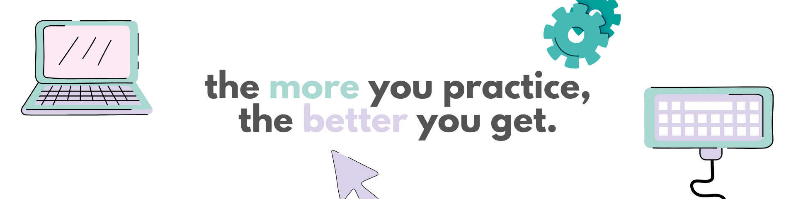

<!-- gif , img , emoji , icon , content , link  https://forthebadge.com/  canva: header -->

<h1 align="center">Hi 👋, I'm Piyush</h1>
<h3 align="center">A Web Developer with a knack for Open Source</h3>

<!--  -->

 
  
  
  <a href="https://piyush-linux.github.io" target="_blank">
      <!-- sqlite, safari, google-chrome are other good icon options -->
  </a>

<!--  -->
 
 

<table>
  <tr>
    <td>
      
<!--        -->
    </td>
    <td align="left">
                             
<strong style="font-size: 45px;">P I Y U S H</strong>  
- 🔭 I’m currently working on NextJS  
- 🌱 I’m currently learning **Strapi CMS**  
- ⚡ Fun fact **I Love Anime**  
- 🐱 I love cats!  
- 🤍 Twitter/X : https://twitter.com/piyush_linux  
- 💙 LinkedIn : https://www.linkedin.com/in/shubham-chavan-dev/  
- 💜 Mastodon : https://mastodon.social/@piyush_linux  
- 💚 Website : https://piyush-linux.github.io  

    </td>
  </tr>
</table>

 

| My Setup | meow meow | 
| -- | -- | 
| 🐧 OS | Linux : Archcraft    | 
| 💻 Tools | Sublime, Brave, Alacritty, Neovim  |
| 🗒️ Note Taking |  Obsidian :    `Fit_Sync, RoyalVelvel, EmojiShortCode, OmniSearch, Calendar, HomePage, PomodoroTimer` |

 

<h2 align="center">⚒️ Languages-Frameworks-Tools ⚒️</h2>
 

      
      
     

---

## 🚀 Projects

### 🌐 Website Development

* **Luxury Home** – Real estate landing page
  🔗 [Visit Site](https://elegant-home.netlify.app/)
  
* **Plant Website** : https://piyush-linux.github.io/web-plant/
* **Baiju Ghandat** – https://baijughandat.netlify.app

### 🖥️ CMS Applications

Built CMS dashboards or websites for educational institutions:

* **Elphinstone College**
* **Secondary Training College**
* **The Institute of Science**

### 🧩 Fullstack Applications

* *(Projects to be listed or in development)*

### 🤖 LLM & AI Agents

* *(Projects using Large Language Models or AI tools)*

### Blockchain & Crypto
- Ek Cup Chai : Donation in Crypto (Similar to Buy me a Coffee)
* *(Projects using Large Language Models or AI tools)*

### 🐧 Linux & Tools

* **Openbox** – (Projects using Large Language Models or AI tools)
* **Packit** – (Projects using Large Language Models or AI tools)
* **Namaskar** - Neofetch Minimal Version : [Visit Me !](https://github.com/Piyush-linux/namaskar) || https://namaskar-fetch.netlify.app/

